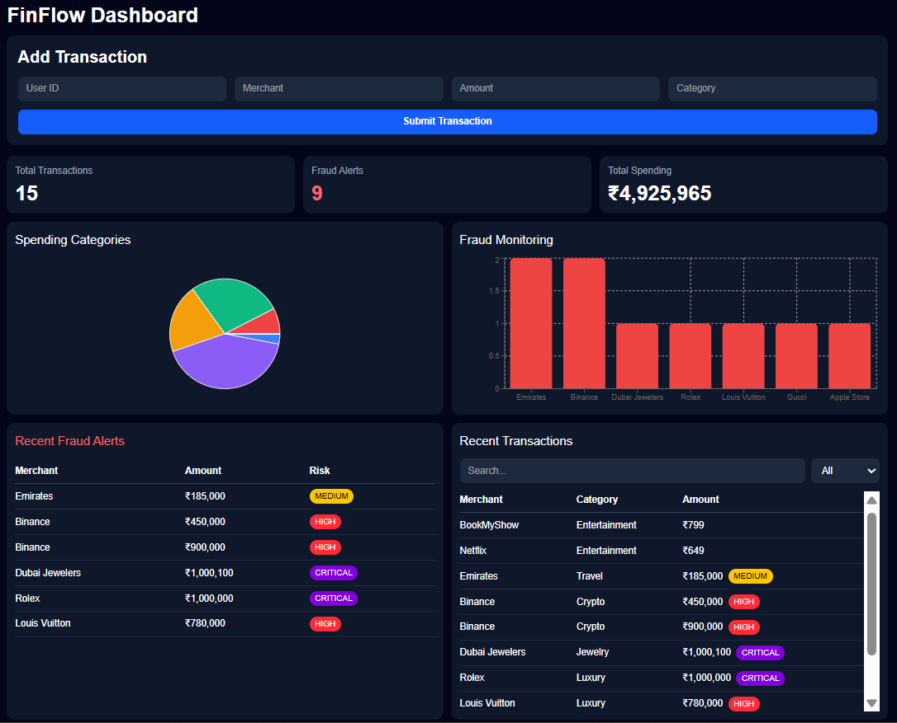
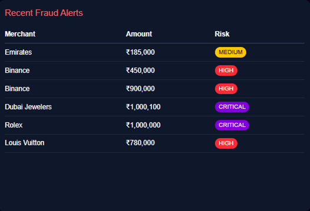
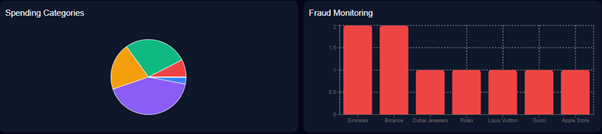
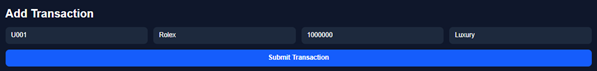

# FinFlow — Real-Time Fraud Detection Dashboard

*A distributed fintech monitoring system built with Spring Boot, Kafka, PostgreSQL, MongoDB, and React.*

A full-stack fintech analytics platform built using a **microservices architecture** to simulate real-time transaction monitoring and fraud detection.
The system processes transactions through **Apache Kafka**, analyzes suspicious activity using a fraud detection service, and visualizes everything on an interactive dashboard.

Built as a hands-on project to explore distributed systems, event-driven architecture, real-time analytics, and modern full-stack development.

---

# Features

- Real-time transaction processing
- Kafka-based event streaming pipeline
- Fraud detection engine with severity classification
- Interactive analytics dashboard
- Live fraud monitoring charts
- Transaction search and filtering
- Responsive fintech-style UI
- Dual database architecture using PostgreSQL + MongoDB
- Docker-based Kafka and Zookeeper setup

---

# Fraud Detection Logic

The fraud service analyzes incoming transactions and classifies them into risk levels:

| Amount Range           | Risk Level |
| ---------------------- | ---------- |
| ₹100,000 – ₹299,999    | MEDIUM     |
| ₹300,000 – ₹999,999    | HIGH       |
| ₹1,000,000 and above   | CRITICAL   |

Fraud alerts are stored separately in MongoDB Atlas for fast retrieval and analytics.

---

# Tech Stack

## Backend

- Java
- Spring Boot
- Spring Web
- Spring Data JPA
- Spring Kafka
- Apache Kafka
- PostgreSQL
- MongoDB Atlas
- Maven
- Lombok
- REST APIs

## Frontend

- React
- Vite
- Tailwind CSS
- Axios
- Recharts

## Infrastructure & Architecture

- Microservices Architecture
- Event-Driven Architecture
- Kafka Producer/Consumer Pipeline
- Docker-based Kafka and Zookeeper setup
- Dual Database Architecture

---

# System Architecture

```text
Frontend Dashboard (React)
        │
        ▼
Transaction Service (Spring Boot)
        │
        ├── Stores Transactions → PostgreSQL
        │
        └── Publishes Events → Kafka Topic
                                      │
                                      ▼
                        Fraud Service (Spring Boot)
                                      │
                                      ├── Consumes Kafka Events
                                      ├── Detects Fraud
                                      └── Stores Alerts → MongoDB Atlas
```

---

# Dashboard Modules

- Transaction Submission Panel
- Total Transactions Counter
- Fraud Alerts Counter
- Total Spending Tracker
- Spending Categories Pie Chart
- Fraud Monitoring Bar Graph
- Recent Fraud Alerts Table
- Recent Transactions Table
- Risk-Level Badges (MEDIUM / HIGH / CRITICAL)

---

# Project Structure

```text
finflow/
│
├── frontend/                  # React + Vite frontend
│
├── transaction-service/       # Transaction microservice
│
├── fraud-service/             # Fraud detection microservice
│
├── screenshots/               # Project screenshots for README
│
├── docker-compose.yml         # Kafka & Zookeeper setup
│
├── .gitignore
│
└── README.md
```

---

# How It Works

1. User submits a transaction from the dashboard.
2. Transaction Service stores it in PostgreSQL.
3. The transaction is published to a Kafka topic.
4. Fraud Service consumes the event from Kafka.
5. Suspicious transactions are classified by risk level.
6. Fraud alerts are stored in MongoDB Atlas.
7. Frontend fetches live updates and visualizes the data.

---

# Running the Project Locally

## 1. Clone the Repository

```bash
git clone https://github.com/Madhur-Bakshi/finflow.git
cd finflow
```

---

## 2. Start Kafka & Zookeeper

```bash
docker run -d --name zookeeper -p 2181:2181 zookeeper

docker run -d --name kafka -p 9092:9092 ^
-e KAFKA_ZOOKEEPER_CONNECT=host.docker.internal:2181 ^
-e KAFKA_ADVERTISED_LISTENERS=PLAINTEXT://localhost:9092 ^
-e KAFKA_OFFSETS_TOPIC_REPLICATION_FACTOR=1 ^
confluentinc/cp-kafka
```

---

## 3. Configure Environment Variables

### Transaction Service

```properties
DB_URL=
DB_USERNAME=
DB_PASSWORD=
KAFKA_SERVER=localhost:9092
```

### Fraud Service

```properties
MONGO_URI=
KAFKA_SERVER=localhost:9092
```

---

## 4. Run Backend Services

### Transaction Service

```bash
cd transaction-service
mvn spring-boot:run
```

### Fraud Service

```bash
cd fraud-service
mvn spring-boot:run
```

---

## 5. Run Frontend

```bash
cd frontend
npm install
npm run dev
```

---

# Dashboard Preview

## Main Dashboard



## Fraud Detection System



## Analytics & Monitoring



## Transaction Submission



---

# Future Improvements

- AI/ML-based fraud prediction
- JWT authentication
- Role-based admin dashboards
- Redis caching
- Real-time WebSocket updates
- Kubernetes deployment
- Transaction history analytics
- Email/SMS fraud notifications

---

# What I Learned

Through this project, I explored:

- Microservices communication
- Kafka event streaming
- Real-time system design
- Distributed architectures
- Database separation strategies
- Full-stack integration
- Dockerized development workflows
- Fraud monitoring concepts

---

# Author

**Madhur Bakshi**

---
